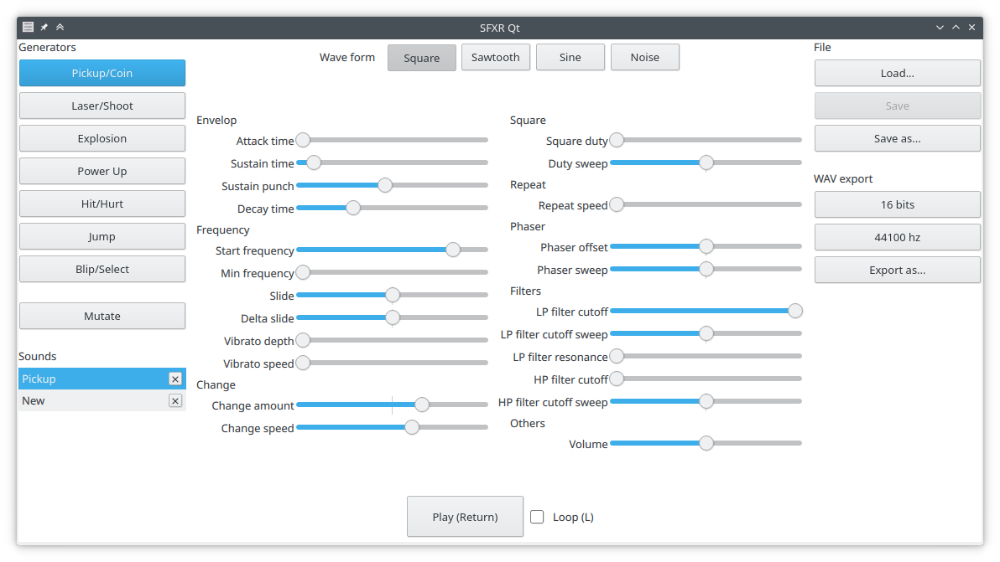

# SFXR Qt

This a QtQuick Controls 2 port of [SFXR][]. SFXR is a sound effect generator created by DrPetter to quickly produce retro-sounding sound effects for games.

This project has the same features as the original SFXR, with a more modern user interface and, dare I say, a more modular code base. Meaning DrPetter did all the hard work, I just refactored and plugged a new UI on top of it.

## Usage

Start the application and click on one of the generator buttons. Then play with the sliders to produce the sound you want. When you are happy with the result, use the "Export as..." button to create a wav file, or the "Save as..." button to save it in [SFXJ format][format], so that you can work on it later.

[format]: docs/file-formats.md

For more details, you should read the original [SFXR readme.txt](readme-sfxr-sdl.txt).

### Tips

Right-clicking on a slider resets its value to 0.

You can use the mouse wheel to adjust the slider value. Hold-down Shift to make bigger changes.

### Command-line usage

You can use the `--export` option to export your SFXR or SFXJ files to wav files from the command-line. Look at the output of `sfxr-qt --help` for details.

## Precompiled binaries

Precompiled binaries for Linux are available in the [releases section][ghr].

[ghr]: https://github.com/agateau/sfxr-qt/releases

## Building

### Step 1

Building SFXR Qt requires installing the following tools:

- A C++ 17 compiler
- Qt 5.7
- SDL 1.2
- CMake 3.17 (You might be able to build with older versions if you adjust the minimum version in the `CMakeLists.txt` file, let me know if you do)

### Step 2

Building SFXR Qt also requires [qpropgen][], a tool to generate Qt properties.  For now qpropgen is bundled as a Git submodule, so first get the `qpropgen` Git submodule with:

    git submodule update --init

qpropgen is written in Python 3, so make sure you have Python 3 and pip installed, then run:

    pip3 install -r qpropgen/requirements.txt

### Step 3

You can now build SFXR Qt:

    mkdir build
    cd build
    cmake ..
    make

And install it with:

    sudo make install

## License

MIT

[SFXR]: http://www.drpetter.se/project_sfxr.html
[qpropgen]: https://github.com/agateau/qpropgen
